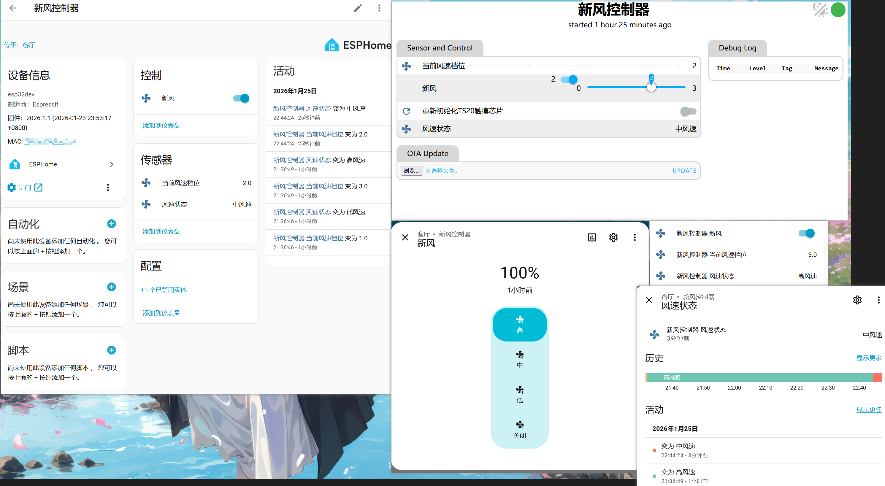

# 美的 XKJG200 新风控制器 ESPHome 组件

本项目使用 ESPHome 和 ESP32 来控制美的 XKJG200 新风系统，通过模拟 TS20 触摸芯片按键来实现风扇控制。

## 效果展示

- 原本的新风面板能正常控制使用，并且状态会同步到 Home Assistant 中
- Home Assistant 中可以远程控制新风系统的开关和风速，并且原来的面板状态也会同步更新



## 功能特性

- ✅ 通过 Home Assistant 远程控制新风系统
- ✅ 支持3档风速调节（低/中/高）
- ✅ 实时显示当前风速状态
- ✅ Web 界面控制
- ✅ OTA 固件更新

## 工作原理

```
┌─────────────────┐      I2C (从机)      ┌─────────────────┐
│   XKJG200       │ ◄──────────────────► │                 │
│   控制面板       │                       │     ESP32       │
│   (上位机)       │      风速LED状态      │                 │
│                 │ ────────────────────► │                 │
└─────────────────┘                       └────────┬────────┘
                                                   │
                                                   │ I2C (主机)
                                                   ▼
                                          ┌─────────────────┐
                                          │   TS20 触摸芯片  │
                                          └─────────────────┘
```

ESP32 同时作为：

1. **I2C 从机**：响应上位机(XKJG200控制面板)读取触摸芯片状态
2. **I2C 主机**：控制 TS20 触摸芯片
3. **状态监测**：读取风速状态引脚获取当前风速

## 硬件连接

- 参考 项目根目录下`doc/` 目录下的图片和文档

### I2C 从机配置 (连接上位机)

| ESP32 引脚 | 功能  |
|----------|-----|
| GPIO 21  | SDA |
| GPIO 22  | SCL |

I2C 从机地址：`0x7A`

### I2C 主机配置 (连接 TS20 触摸芯片)

| ESP32 引脚 | 功能  |
|----------|-----|
| GPIO 16  | SDA |
| GPIO 17  | SCL |

I2C 主机频率：100kHz，目标地址：`0x7A`

### 风速状态输入引脚 (LED 状态检测，低电平有效)

| ESP32 引脚 | 功能  |
|----------|-----|
| GPIO 25  | 低风速 |
| GPIO 26  | 中风速 |
| GPIO 27  | 高风速 |

### 上位机电源控制

| ESP32 引脚 | 功能             |
|----------|----------------|
| GPIO 4   | 上位机电源控制（低电平断电） |

## 文件结构

```
esphome/
├── README.md                      # 本文档
├── example_secrets.yaml           # 密钥配置示例
├── fan-controller.yaml            # ESPHome 主配置文件
└── components/
    └── xkjg200_fan/
        ├── __init__.py            # ESPHome 组件定义
        └── xkjg200_fan.h          # 组件核心实现
```

## 快速开始

### 1. 配置密钥文件

复制示例密钥文件并修改为实际配置：

```bash
cp example_secrets.yaml secrets.yaml
```

编辑 `secrets.yaml`：

```yaml
wifi_ssid: "你的WiFi名称"
wifi_password: "你的WiFi密码"
api_xkjg200_key: "你的API加密密钥"
ota_key: "你的OTA密码"
```

> 💡 可使用 `openssl rand -base64 32` 生成 API 加密密钥

### 2. 编译和上传

使用 ESPHome 编译并上传固件：

```bash
esphome run fan-controller.yaml
```

### 3. 添加到 Home Assistant

固件上传后，Home Assistant 会自动发现设备。使用配置文件中的 API 加密密钥添加设备即可。

## 组件使用

### 配置示例

```yaml
# 加载外部组件
external_components:
  - source: github://julen8/midea_xkjg200
    components: [ xkjg200_fan ]

# xkjg200 风扇控制器组件
xkjg200_fan:
  id: xkjg200_controller

# 风扇组件
fan:
  - platform: template
    name: "新风"
    id: main_fan
    speed_count: 3
    on_turn_on:
      - lambda: |-
          int speed = id(main_fan).speed;
          if (speed == 0) speed = 2;
          id(xkjg200_controller)->set_fan_speed(speed);
    on_turn_off:
      - lambda: |-
          id(xkjg200_controller)->set_fan_speed(0);
```

> 具体配置参见 `fan-controller.yaml`

### API 方法

| 方法                         | 说明                       |
|----------------------------|--------------------------|
| `set_fan_speed(int speed)` | 设置风速：0=关闭, 1=低, 2=中, 3=高 |
| `get_current_speed()`      | 获取当前风速档位 (0-3)           |
| `init_ts20_registers()`    | 重新初始化 TS20 触摸芯片寄存器       |

## 触摸按键编码

| 按键  | 数据 (buffer[0], buffer[1], buffer[2]) |
|-----|--------------------------------------|
| 开关  | `0x04, 0x00, 0x00`                   |
| 经济  | `0x20, 0x00, 0x00`                   |
| 风速+ | `0x00, 0x01, 0x00`                   |
| 风速- | `0x10, 0x00, 0x00`                   |

## Web 界面

设备启动后可通过 `http://<设备IP>/` 访问 Web 界面进行控制。

如果无法连接 WiFi，设备会创建一个名为 `xkjg200-AP` 的热点（密码：`12345678`），连接后可通过 captive portal 配置 WiFi。

## 作者

@julen
